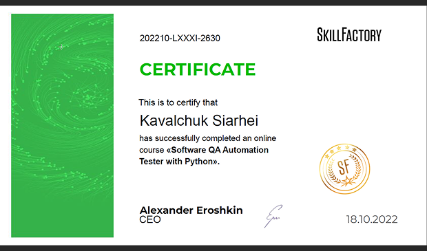
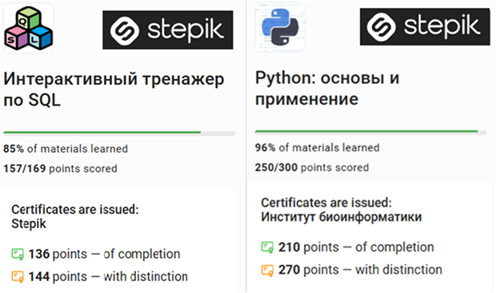

# Sergey Kovalchuk
### Junior Frontend Developer

---

### Contact information:

**Phone:** +375(29)802-99-06  
**E-mail:** kovalchuksiargey@gmail.com  
**Telegram:** @sergiokavalli  
[LinkedIn](https://www.linkedin.com/in/sergey-kovalchuk/)

---

### About Myself:

Hi! I'm glad to welcome you to my gh-pages profile. 

I'm a purposeful and highly motivated person who quickly adapts to new conditions. My qualities, such as sociability and flexibility, make me good at teamwork. I am well organized and detail oriented, which allows me to successfully carry out my duties.

**Professional interests:**   
- Learning Frontend Technologies
- Reading of professional books and Web-sources (articles, professional courses, YouTube, forums etc.)

---

### Hard Skills:

 - Front Dev: HTML(basics), CSS(basics), JS(basics), Python(basics)
 - Framework: React(basics)
 - Control Version: GIT, GitHub, BitBucket 
 - API Testing Tools: Postman(basics)
 - DB Management: MySQL(basics), PostgreSQL(basics)

---

### Soft Skills:

- I'm always open to new experiences

---

### Code example:

*Classic Bubble sort alghorithm on JS:*

```javascript
// BubbleSort O(n*n)
  const arr = [
    3, 0, 2, 5, 6, 8, 1, 9, 4, 2, 1, 2, 9, 6, 4, 1, 7, -1, -5, 23, 6, 2, 35, 6,
    3, 32,
  ];
  let count = 0;
  function bubbleSort(arr) {
    const n = arr.length;
    for (let i = 0; i < n - 1; i++) {
      for (let j = 0; j < n - 1 - i; j++) {
        if (arr[j + 1] < arr[j]) {
          let t = arr[j + 1];
          arr[j + 1] = arr[j];
          arr[j] = t;
        }
        count += 1;
      }
    }
    return arr;
  }
  console.log("result:", bubbleSort(arr));
  console.log("legth:", arr.length);
  console.log("count of iteration:", count)
```
---

### Courses:

- Course QA Automation Tester on Python [SkillFactory](https://skillfactory.ru/)  

- SQL and Python basic course [Stepik](https://stepik.org)  


---

### Languages:

- English \- Pre-Intermediate
- Russian \- Native